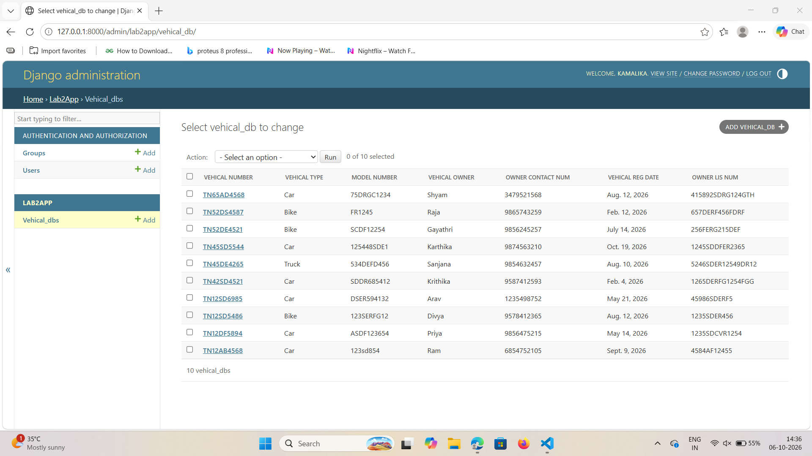

# Ex02 Django ORM Web Application
## Date: 06-10-2026

## AIM
To develop a Django Application to store and retrieve data from a Vehicle Service Database platform using Object Relational Mapping(ORM).


## DESIGN STEPS

### STEP 1:
Clone the problem from GitHub

### STEP 2:
Create a new app in Django project

### STEP 3:
Enter the code for admin.py and models.py

### STEP 4:
Detect changes and create migration files that describe how to modify the database schema

### STEP 5:
Execute the migration files and update the database schema to match your Django models

### STEP 6:
Create a superuser with full access rights to all models and data through the admin interface.

### STEP 7:
Apply the migration files of the created app to the database

### STEP 8:
Execute Django admin using localhost and create details for 10 entries

## PROGRAM
```
models.py

from django.db import models
from django.contrib import admin
class vehical_db(models.Model):
    Vehical_number=models.CharField(max_length=10,primary_key=True)
    vehical_reg_date=models.DateField()
    Vehical_type=models.CharField(max_length=20)
    Model_number=models.CharField(max_length=10)
    vehical_owner=models.CharField(max_length=30)
    Owner_lis_num=models.CharField(max_length=20)
    Owner_Contact_Num=models.IntegerField()
class vehical_admin(admin.ModelAdmin):
    list_display=["Vehical_number","Vehical_type","Model_number","vehical_owner","Owner_Contact_Num","vehical_reg_date","Owner_lis_num"]

admin.py

from django.contrib import admin
from .models import vehical_db,vehical_admin
admin.site.register(vehical_db,vehical_admin)
```


## OUTPUT



## RESULT
Thus the program for creating Online Food Delivery Database using ORM hass been executed successfully
